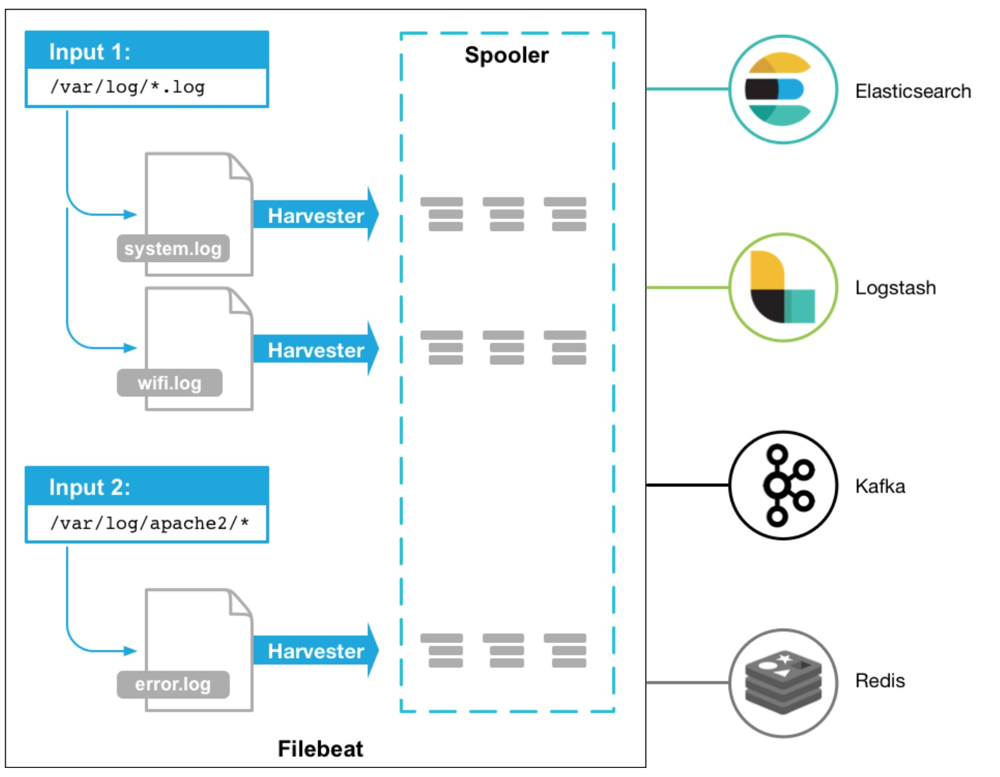

filebeat.doc1

[TOC]
### 1. 组成简介

filebeat主要包含两个部分：`inputs`和`harvesters`  
**1.1 harvesters**  
`harvesters`负责读取单个文件的内容，逐行读取并将内容发送到`output`，收集器负责打开和关闭文件，这意味着文件描述符在收集器运行时保持打开状态。每个文件都启动一个`harvester`，如果文件在被收集时被删除或重命名，Filebeat将继续读取该文件。这会产生副作用，即在收集器关闭之前，磁盘上的空间是保留的。默认情况下，Filebeat会保持文件处于打开状态，直到[close_inactive](https://www.elastic.co/guide/en/beats/filebeat/6.3/filebeat-input-log.html#filebeat-input-log-close-inactive)(默认`5m`)达到。  
   
关闭收集器会产生以下后果：  
- 文件处理程序已关闭，如果在收集器仍在读取文件时删除了文件，则释放底层资源。
- 只有在[scan_frequency](https://www.elastic.co/guide/en/beats/filebeat/6.3/filebeat-input-log.html#filebeat-input-log-scan-frequency)(默认`10s`)经过时才会再次开始收集文件。
- 如果在收集器关闭时移动或移除文件，则不会继续收集文件。    

要控制收集器何时关闭，请使用[close_*](https://www.elastic.co/guide/en/beats/filebeat/6.3/filebeat-input-log.html#filebeat-input-log-close-options)配置选项。
  
**1.2 inputs**  
负责管理`harvesters`并查找读取的所有源，`harvesters`关闭后文件发生改变，则只读取新行。  
`inputs`支持的类型见[inputs types](https://www.elastic.co/guide/en/beats/filebeat/6.3/configuration-filebeat-options.html)。

### 2. filebeat如何保持文件状态
Filebeat保持每个文件的状态，并经常将状态刷新到注册表文件中的磁盘,具体配置文件`filiebeat.yml`中变量`path.data`。状态用于记住收集器正在读取的最后一个偏移量并确保发送所有日志行。如果无法访问输出（如Elasticsearch或Logstash），Filebeat会跟踪发送的最后一行，并在输出再次可用时继续读取文件。在Filebeat运行时，状态信息也会保存在内存中以用于每个输入。重新启动Filebeat时，来自注册表文件的数据用于重建状态，Filebeat会在最后一个已知位置继续运行每个收集器。

对于每个输入，Filebeat保持它找到的每个文件的状态。由于可以重命名或移动文件，因此文件名和路径不足以标识文件。对于每个文件，Filebeat存储唯一标识符以检测先前是否收获了文件。

如果您的用例涉及每天创建大量新文件，您可能会发现注册表文件变得太大。看[注册表文件太大了？](https://www.elastic.co/guide/en/beats/filebeat/6.3/faq.html#reduce-registry-size)编辑有关可以设置以解决此问题的配置选项的详细信息。

### 3. filebeat如何确保至少一次发送
Filebeat保证事件将至少一次传递到配置的输出，并且不会丢失数据。Filebeat能够实现此行为，因为它将每个事件的传递状态存储在注册表文件中。

在已定义的输出被阻止且尚未确认所有事件的情况下，Filebeat将继续尝试发送事件，直到输出确认已收到事件。

如果Filebeat在发送事件的过程中关闭，它不会等待输出在关闭之前确认所有事件。重新启动Filebeat时，将再次发送任何发送到输出但在Filebeat关闭之前未确认的事件。这可确保每个事件至少发送一次，但最终可能会将重复事件发送到输出。您可以通过设置[shutdown_timeout](https://www.elastic.co/guide/en/beats/filebeat/6.3/configuration-general-options.html#shutdown-timeout)选项将Filebeat配置为在关闭之前等待特定时间。

