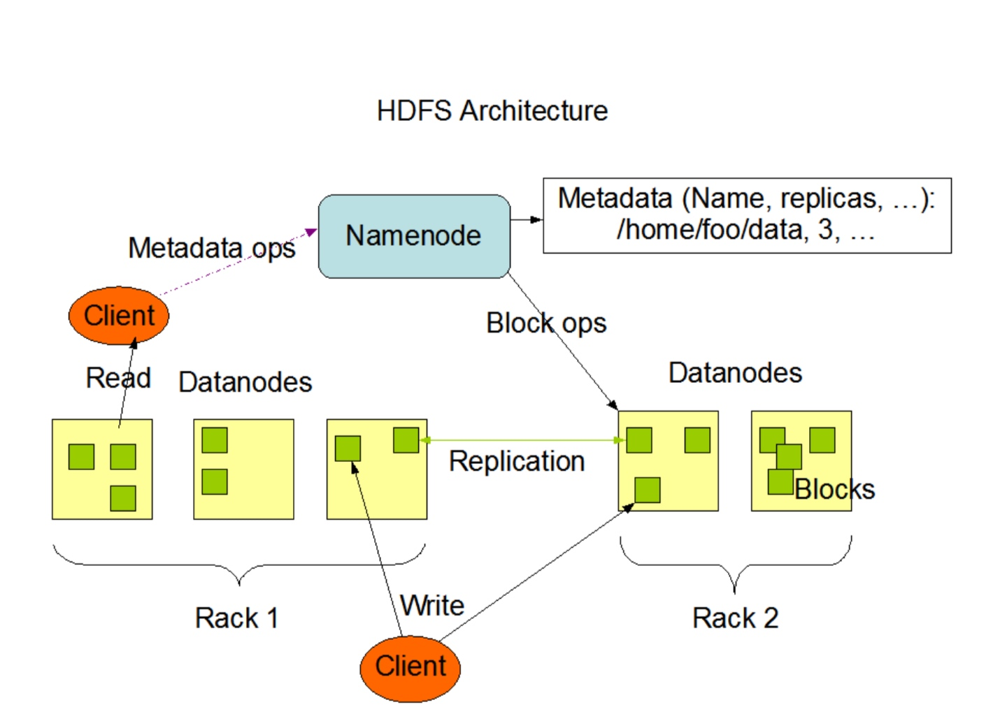

Hadoop

[TOC]
### 架构
HDFS采用**Master/Slave**架构,一个集群中由一个（**仅有一个active**）`Namenode`和多个`Datanodes`组成。Namenode是一个中心服务器，负责管理文件系统的名字空间(**namespace**)以及客户端对文件的访问。内部，一个文件被分成一个或多个数据块，这些块存储在一组Datanode上。Namenode执行文件系统的名字空间操作，比如打开、关闭、重命名文件或目录，同时负责确定数据块到具体Datanode节点的映射。Dataname负责处理文件系统客户端的读写请求，其是在Namenode的统一调度下进行数据块的创建、删除和复制。

### 数据复制
HDFS被设计成最终以数据块做存储，除了最后一个，所有的数据块都是同样大小。为了容错，文件的所有数据块都会有副本。每个文件的数据块大小和副本系数都是可配的。
Namenode全局管理数据块的复制，周期性的从集群的每个Datanode接收心跳信号和块状态报告(**Blockreport**)。心跳信号意味着该Datanode节点工作正常，块状态报告包含了一个该Datanode上所有数据块的列表。
### 安全模式
Namenode启动后会进入一个**安全模式**，在该模式下的Namenode是不会进行数据块的复制的。当Namenode检测确认某个数据块的副本达到指定的最小值，那么该数据块被认为是副本安全(**safely replicated**)；在一定百分比的数据块被Namenode检测确认安全后(加一个额外30s等待时间)，Namenode将退出安全模式。
### 文件系统元数据持久化
任何对文件系统元数据产生修改的操作，Namenode都会使用一种称为EditLog的事务日志记录；整个文件系统的名字空间，包括数据块到文件的映射、文件属性等，都存储在一个FsImage的文件中。  
### 存储空间回收
当用户或应用程序删除某个文件时，这个文件并没有立即从HDFS中删除，而是被重命名转移到/trash目录，只要在/trash目录中，该文件就可以被迅速的恢复，默认策略是保留6小时，超时时间可配置。                                                                                                                                                                                      

### 2.x与3.x主要区别
原文见：<https://data-flair.training/blogs/hadoop-2-x-vs-hadoop-3-x-comparison/>。  

* 支持最低java版本
    - Hadoop 2.x - java的最低支持版本是java 7
    - Hadoop 3.x - java的最低支持版本是java 8
* 容错
    - Hadoop 2.x - 可以通过复制（浪费空间）来处理容错。
    - Hadoop 3.x - 可以通过Erasure编码处理容错。
* 数据平衡
    - Hadoop 2.x - 对于数据，平衡使用HDFS平衡器。
    - Hadoop 3.x - 对于数据，平衡使用Intra-data节点平衡器，该平衡器通过HDFS磁盘平衡器CLI调用。
* 存储schme
    - Hadoop 2.x - 使用3X副本Scheme
    - Hadoop 3.x - 支持HDFS中的擦除编码。
* 存储开销
    - Hadoop 2.x - HDFS在存储空间中有200％的开销。
    - Hadoop 3.x - 存储开销仅为50％。
* 存储开销示例
    - Hadoop 2.x - 如果有6个块，那么由于副本方案（Scheme），将有18个块占用空间。
    - Hadoop 3.x - 如果有6个块，那么将有9个块空间，6块block，3块用于奇偶校验。
* YARN时间线服务
    - Hadoop 2.x - 使用具有可伸缩性问题的旧时间轴服务。
    - Hadoop 3.x - 改进时间线服务v2并提高时间线服务的可扩展性和可靠性。
* 默认端口范围
    - Hadoop 2.x - 在Hadoop 2.0中，一些默认端口是Linux临时端口范围。所以在启动时，他们将无法绑定。
    - Hadoop 3.x - 但是在Hadoop 3.0中，这些端口已经移出了短暂的范围。
* 工具
    - Hadoop 2.x - 使用Hive，pig，Tez，Hama，Giraph和其他Hadoop工具。
    - Hadoop 3.x - 可以使用Hive，pig，Tez，Hama，Giraph和其他Hadoop工具。
* 兼容的文件系统
    - Hadoop 2.x - HDFS（默认FS），FTP文件系统：它将所有数据存储在可远程访问的FTP服务器上。 Amazon S3（简单存储服务）文件系统Windows Azure存储Blob（WASB）文件系统。
    - Hadoop 3.x - 它支持所有前面以及Microsoft Azure Data Lake文件系统。
* HDFS联盟
    - Hadoop 2.x - 在Hadoop 1.0中，只有一个NameNode来管理所有Namespace，但在Hadoop 2.0中，多个NameNode用于多个Namespace。
    - Hadoop 3.x - Hadoop 3.x还有多个名称空间用于多个名称空间。
* 高可用
    - Hadoop 2.x 支持一个standby。
    - Hadoop 3.x 支持多个standby。

